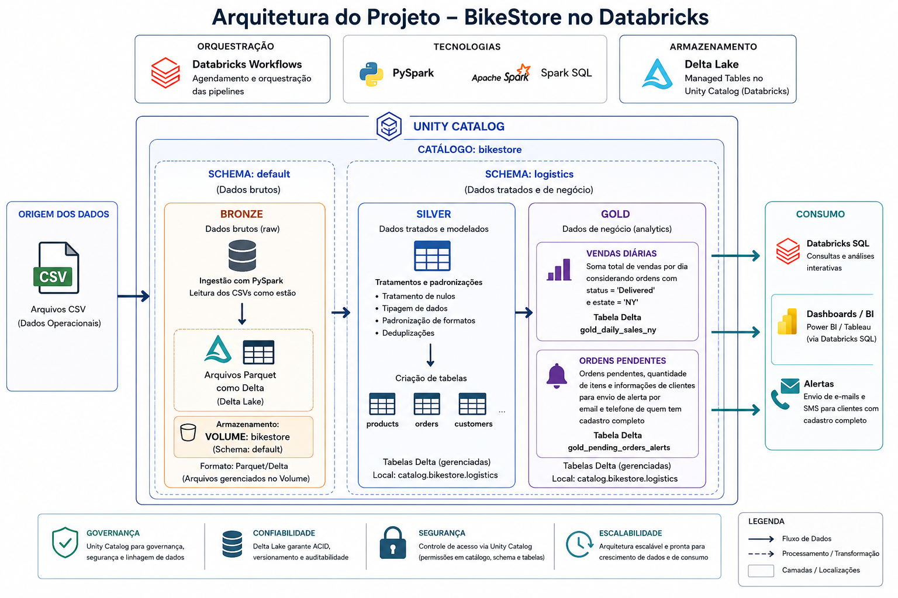
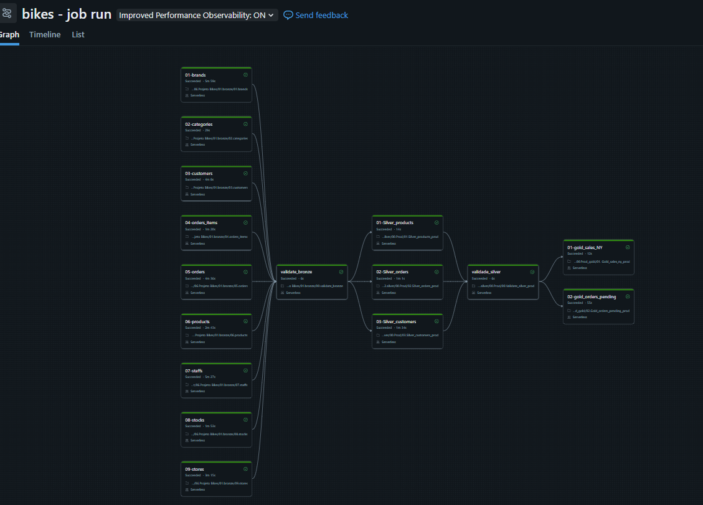

## 🚴 Pipeline de Engenharia de Dados - BikeStore

Este projeto implementa um pipeline de Engenharia de Dados no Databricks seguindo a arquitetura Lakehouse (Medallion Architecture). O fluxo cobre a ingestão de arquivos CSV, o processamento dos dados em camadas sucessivas (Bronze, Silver e Gold) e a entrega de tabelas analíticas prontas para consumo no Databricks SQL e no Power BI.


Arquitetura do projeto:



## 📌 Objetivos
- Desenvolver um pipeline ETL completo no Databricks.
- Seguir o padrão Medallion, organizando os dados em Bronze, Silver e Gold.
- Adotar o Unity Catalog para governança e controle de acesso aos dados.
- Implementar as transformações com PySpark e Spark SQL.
- Disponibilizar tabelas analíticas que apoiem a tomada de decisão.

## 🛠 Tecnologias Utilizadas
| Tecnologia | Utilização |
|---|---|
| Databricks | Plataforma principal |
| PySpark | ETL e transformações |
| Spark SQL | Consultas analíticas |
| Delta Lake | Armazenamento |
| Unity Catalog | Governança |
| Databricks Workflows | Orquestração |
| Databricks Asset Bundles (DABs) | Infraestrutura como código e deploy |
| Git/GitHub | Versionamento |

## 🥉 Camada Bronze

Responsável por ingerir os arquivos CSV mantendo os dados no formato original, sem qualquer transformação.

**Atividades**
- Leitura dos arquivos CSV
- Conversão para o formato Delta
- Armazenamento no Volume do Unity Catalog

## 🥈 Camada Silver

Etapa dedicada à limpeza e padronização das informações vindas da camada Bronze.

**Transformações**
- Tratamento de valores nulos
- Padronização dos tipos de dados
- Remoção de duplicidades
- Criação das tabelas dimensionais

**Tabelas**
- silver_customers
- silver_orders
- silver_products

## 🥇 Camada Gold

Camada voltada para consumo analítico, com dados já modelados para relatórios e dashboards.

**Tabela 1**

gold_sales_ny

Regras aplicadas:

- Soma total das vendas por dia
- Considera apenas pedidos com status Delivered
- Filtra somente o estado de NY

**Tabela 2**

gold_orders_pending

Contém:

- Pedidos com status pendente
- Quantidade de itens por pedido
- Nome do cliente
- E-mail
- Telefone

Somente clientes com cadastro completo são considerados.

## 🔄 Orquestração

A execução do pipeline é feita pelo Databricks Workflows, que garante o processamento sequencial das camadas:

```
Bronze
   ↓
Silver
   ↓
Gold

```


## 📦 Databricks Asset Bundles (Infraestrutura como Código)

Junto com o GitHub, o projeto utiliza os **Databricks Asset Bundles (DABs)** para tratar toda a infraestrutura do Databricks como código. Em vez de configurar Workflows, Jobs e Notebooks manualmente pela interface do Databricks, tudo isso é descrito em arquivos de configuração (`databricks.yml`) versionados junto com o restante do código-fonte.

Isso permite que:

- Todo o versionamento — código PySpark, notebooks e definição da infraestrutura — fique centralizado no GitHub.
- O ambiente do Databricks seja recriado de forma consistente e reprodutível a partir do próprio repositório.
- A subida (deploy) dos notebooks e do Workflow no Databricks aconteça automaticamente via CLI do Databricks, integrada aos pipelines do GitHub Actions.
- Mudanças na infraestrutura passem pelo mesmo fluxo de revisão (Pull Request) usado para o código, evitando alterações manuais e não documentadas direto no workspace.

Na prática, o Bundle define os Jobs/Workflows, os caminhos dos notebooks e os parâmetros de execução; o GitHub Actions apenas aciona o comando `databricks bundle deploy`, que sincroniza esse conteúdo com o workspace do Databricks a cada merge na branch `main`.

## 🚀 CI/CD com GitHub Actions e Databricks Asset Bundles

O deploy no Databricks não acontece a cada push em qualquer branch: o desenvolvimento segue normalmente em branches de feature, e o workflow do GitHub Actions só é disparado quando o código chega na `main` — ou seja, no momento em que um Pull Request é aprovado e mergeado. É esse único evento que aciona a validação e o deploy do Databricks Asset Bundle.

### Fluxo de CI/CD

```text
Pull Request aprovado
      │
      ▼
Merge para main
      │
      ▼
Push para main dispara GitHub Actions
      │
      ▼
Job "CI/CD Databricks"
      │
      ├── Checkout do código
      ├── Setup do Databricks CLI
      ├── Verificação da autenticação (databricks current-user me)
      ├── Validação do Bundle (databricks bundle validate)
      └── Deploy do Bundle (databricks bundle deploy)
      │
      ▼
Databricks Workflow atualizado
      │
      ▼
Bronze → Silver → Gold
```

### Funcionalidades implementadas

- ✅ Controle de versão do projeto com Git e GitHub.
- ✅ Workflow único do GitHub Actions, disparado por push na branch `main` após o merge do Pull Request.
- ✅ Autenticação no Databricks via CLI usando secrets do GitHub (`DATABRICKS_HOST` e `DATABRICKS_TOKEN`).
- ✅ Validação automática do Databricks Asset Bundle antes do deploy.
- ✅ Deploy automático do Workflow e dos notebooks assim que o Bundle é validado.
- ✅ Infraestrutura como código (Infrastructure as Code) com Databricks Asset Bundles.
